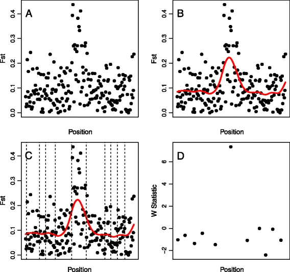

# GenWin
 GenWin -- An R Package that defines window or bin boundaries for the analysis of genomic data. Boundaries are based on the inflection points of a cubic smoothing spline fitted to the raw data. Along with defining boundaries, a technique to evaluate results obtained from unequally-sized windows is provided. Applications are particularly pertinent for, though not limited to, genome scans for selection based on variability between populations (e.g. using     Wright's fixations index, Fst, which measures variability in subpopulations relative to the total population).
  
 # Installation
 Package can be installed from CRAN: [https://CRAN.R-project.org/package=GenWin]
 
 # Description
 
 
 
 The spline-window method is presented step by step using a simulated set of 200 markers across a chromosome region. (A) Raw data (F_ST ) computed from individual markers. (B) A cubic smoothing spline indicated by the red line, is fitted to the data. (C) Inflection points of the spline are indicated by dashed vertical lines. (D) Inflection points of the spline are used to define window boundaries, and a statistic such as W ("window stat") is computed.
 
 A complete description of the package and methodology was published at GSE, here: [https://gsejournal.biomedcentral.com/articles/10.1186/s12711-015-0105-9]. 

